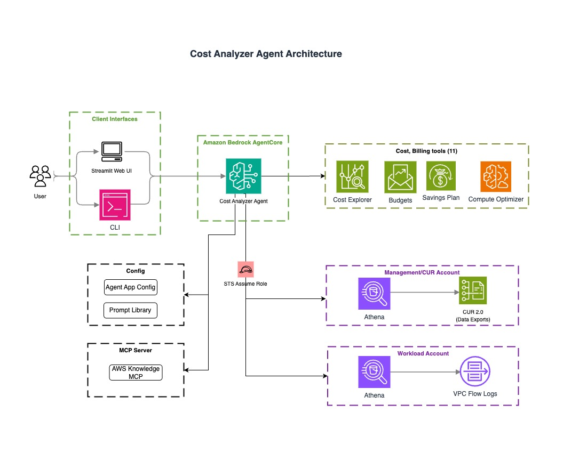

# AWS Cost Analyzer Agent — AI-Powered FinOps with Amazon Bedrock AgentCore

Analyze, optimize, and report on AWS cloud costs using natural language - connecting billing data to network and usage signals. Built with [Amazon Bedrock AgentCore](https://aws.amazon.com/bedrock/agentcore/) and [Strands Agents SDK](https://github.com/strands-agents/sdk-python).

[](https://opensource.org/licenses/MIT-0)
[](https://www.python.org/downloads/)
[](https://aws.amazon.com/bedrock/agentcore/)
[](https://github.com/strands-agents/sdk-python)

> ⚠️ **Disclaimer:** Code is provided under MIT-0 license. Review, fine tune, and test before using it in production. Review all configurations, IAM permissions, and costs before deploying in any environment.

## What Is This?

AWS Cost Analyzer Agent is an open-source AI agent for AWS cloud cost management. It helps FinOps teams, cloud engineers, and finance stakeholders analyze, understand, and optimize AWS spending across multiple accounts using natural language — no console navigation or SQL query knowledge required.

The agent unifies **43 AWS billing APIs** (Cost Explorer, Budgets, Savings Plans, Compute Optimizer, Pricing etc), **CUR 2.0 resource-level analysis** via Amazon Athena, and **VPC Flow Log network traffic insights** into a single conversational interface accessible via CLI or Streamlit web UI.

## The Problem It Solves

Managing AWS costs at scale is complex. FinOps teams juggle multiple disconnected tools — Cost Explorer for spending trends, CUR reports for resource-level details, Compute Optimizer for rightsizing, Savings Plans dashboards for commitment coverage. Each has its own interface, query language, and learning curve. Getting a complete picture requires manual correlation across these tools, Athena SQL expertise for CUR analysis, and significant time investment.

Beyond billing data, a critical blind spot exists: **data transfer costs**. Existing cost tools can tell you data transfer is expensive, but can't pinpoint *which network flows between which resources or process* are driving those costs. VPC Flow Logs hold this answer, but no native AWS tool correlates flow log data with billing data automatically.

AWS Cost Analyzer Agent solves both challenges — it unifies billing APIs, CUR resource-level analysis, and VPC Flow Log network insights behind a single natural language interface. Ask a question in plain English, and the agent determines which data sources to query, correlates the results, and delivers actionable recommendations.

## Use Cases

| Scenario | What the agent does |
|----------|-------------------|
| **Cloud cost reporting** | Generate cost breakdowns by service, account, region, or tag without writing queries |
| **Resource-level cost attribution** | Identify the most expensive EC2 instances, S3 buckets, RDS databases, or Lambda functions using CUR data |
| **Savings Plans & RI analysis** | Check coverage, utilization, and get purchase recommendations |
| **Rightsizing recommendations** | Find over-provisioned or idle EC2, EBS, RDS, Lambda, and ECS resources via Compute Optimizer |
| **Data transfer cost investigation** | Pinpoint which resources drive cross-AZ, inter-region, and internet egress costs using VPC Flow Logs |
| **Cost anomaly detection** | Identify unexpected spending spikes across services |
| **Multi-account FinOps** | Analyze costs across AWS Organizations with cross-account role assumption |
| **Cost forecasting** | Project future spend based on historical patterns |

## Key Features

| Feature | Description |
|---------|-------------|
| 💰 **43 AWS Billing APIs** | Cost Explorer, Budgets, Savings Plans, Compute Optimizer, Pricing, Billing Conductor — all accessible via natural language |
| 🎯 **Cost Optimization** | Rightsizing, idle resources, Savings Plans, Reserved Instances via Cost Optimization Hub and Compute Optimizer |
| 🔍 **VPC Flow Log Analysis** | Identify cross-AZ, inter-region, and internet egress cost drivers at the resource,process level (optional) |
| 🏢 **Multi-Account Support** | Cross-account access via STS assume role with credential caching for AWS Organizations |
| 🔎 **Auto-Discovery** | Automatically discovers Athena tables via AWS Glue Catalog — no table name configuration needed |
| 📚 **AWS Knowledge Base** | Search AWS documentation for cost optimization best practices via MCP |
| ⚡ **Prompt Caching** | Up to 90% cost reduction and 85% faster responses with Amazon Bedrock prompt caching |
| 🛡️ **Security Built-In** | SQL injection prevention, prompt injection protection, config integrity validation, credential masking |
| 🤖 **Agentic AI** | Built with Strands Agents SDK on Amazon Bedrock AgentCore with Claude Sonnet 4.5 |
| 📋 **Prompt Library** | Pre-built query templates for common FinOps scenarios — cost overviews, service deep dives, optimization, data transfer, VPC analysis, and more |

## How It Works

```
User: "Which EC2 instances cost the most last month?"
  │
  ▼
Strands Agent (Claude Sonnet 4.5 on Bedrock AgentCore)
  ├── Calls get_current_date_context() → determines date range
  ├── Calls execute_cur_athena_query() → SQL against CUR 2.0 in Athena
  └── Returns: Top instances with costs, usage types, and regions
```

The agent autonomously selects from 11 tools based on the question:
- **Service-level questions** → Cost Explorer API (fast, aggregated)
- **Resource-level questions** → CUR Athena queries (detailed, per-resource)
- **Network questions** → VPC Flow Log Athena queries (traffic patterns)
- **Optimization questions** → Compute Optimizer + Cost Optimization Hub + AWS Knowledge MCP

## Architecture



## Prerequisites

- Python 3.10+
- AWS CLI configured (`aws sts get-caller-identity`)
- Amazon Bedrock model access enabled (default: Claude Sonnet 4.5, configurable in `agent/config.yaml`)
- Cost and Usage Report data accessible via Athena — set up using [AWS Data Exports](https://docs.aws.amazon.com/cur/latest/userguide/dataexports-create-standard.html). Legacy CUR format is not tested.
- IAM permissions configured — see [IAM Permissions](docs/iam-permissions.md) for required policies
- (Optional) VPC Flow Logs configured with a **custom log format** that includes fields required for analysis (`instance-id`, `az-id`, `srcaddr`, `dstaddr`, `bytes`, `start`, `end`, `protocol`, `action`, `log-status`). The default log format does not include all required fields. See [Configuration Guide](docs/configuration.md#vpc-flow-logs-custom-log-format) for the recommended format.

## Quick Start

### 1. Clone and configure

```bash
git clone https://github.com/aws-samples/sample-cost-analyzer-agent.git
cd sample-cost-analyzer-agent
cp agent/config.yaml.example agent/config.yaml
```

Edit `agent/config.yaml` with your accounts and Athena settings. See [Configuration Guide](docs/configuration.md) for details.

```yaml
accounts:
  - account_id: "<PAYER_ACCOUNT_ID>"
    role_arn: "arn:aws:iam::<PAYER_ACCOUNT_ID>:role/CostAnalyzerAgentPayerRole"
    account_type: payer
    athena:
      cur:
        database: <YOUR_CUR_DATABASE>
        # table: <YOUR_CUR_TABLE>  # Optional — agent auto-discovers if omitted
```

### 2. Export AWS credentials

```bash
# Set temporary AWS credentials (from SSO, assume-role, or Identity Center)
export AWS_ACCESS_KEY_ID=ASIA...
export AWS_SECRET_ACCESS_KEY=...
export AWS_SESSION_TOKEN=...

# Verify access
aws sts get-caller-identity
```

### 3. Deploy

```bash
./deploy.sh
```

### 4. Use

```bash
# Interactive CLI
./cli/cli.sh

# Single query
./cli/cli.sh -q "What are my top 5 services by cost last month?"

# Localhost Web UI (optional)
cd frontend && streamlit run app.py
```

> ⚠️ **Security Note:** The Local host Streamlit web UI has no built-in authentication. Run it locally and do not expose it to the internet. For network access, restrict through security groups. For production deployments with authentication, see [sample-amazon-bedrock-agentcore-fullstack-webapp](https://github.com/aws-samples/sample-amazon-bedrock-agentcore-fullstack-webapp).

## Example Queries

Ask questions in plain English — the agent handles the rest:

```
# Cost overview
What were my top 5 services by cost last month?
Compare costs between last month and this month
What's my cost forecast for next month?

# Resource-level analysis (uses CUR via Athena)
Which EC2 instances cost the most?
Show me my S3 storage costs by bucket
What Lambda functions have the highest costs?

# Optimization
Show me cost optimization recommendations
What are my Savings Plans utilization rates?
Identify idle and underutilized resources
What rightsizing recommendations do you have for EC2?

# Data transfer & networking (uses VPC Flow Logs)
What are my data transfer costs by service?
Analyze VPC Flow Logs for top network talkers
Which instances generate the most cross-AZ traffic?
```

## Project Structure

```
├── agent/                  # Agent deployment (deploy once)
│   ├── agentcore_agent.py  # AgentCore entrypoint
│   ├── config.yaml.example # Configuration template
│   ├── prompts/            # System prompt
│   ├── services/           # Config, Athena, MCP, session management
│   └── tools/              # Billing, Athena, date, analysis tools
├── cli/                    # CLI interface (daily use)
├── frontend/               # Optional Streamlit web UI
├── shared/                 # Shared client config and prompt library
├── tests/                  # Property-based tests (hypothesis)
└── deploy.sh               # One-command deployment
```

## Documentation

| Document | Description |
|----------|-------------|
| [Configuration Guide](docs/configuration.md) | Account setup, Athena config, cross-account access, prompt caching |
| [IAM Permissions](docs/iam-permissions.md) | Required IAM policies for deployment, invocation, and runtime |
| [Tools Reference](docs/tools.md) | 43 billing APIs + 8 specialized tools (Athena, date, analysis, MCP) |
| [CLI Guide](cli/README.md) | CLI usage, prompt library, debug mode |

## Supported and Not Supported

| Feature | Status | Notes |
|---------|--------|-------|
| CUR 2.0 (AWS Data Exports) | ✅ Supported | Tested and designed for this format |
| Legacy CUR | ⚠️ Not tested | May work but column compatibility is not verified |
| VPC Flow Logs to S3 (Athena) | ✅ Supported | Parquet format recommended |
| VPC Flow Logs to CloudWatch Logs | ❌ Not supported | Only S3-based Flow Logs queryable via Athena |
| Multi-account (Organizations) | ✅ Supported | Payer + member accounts via STS role assume role |

## Troubleshooting

| Issue | Fix |
|-------|-----|
| "Agent not found" | Check agent ID in shared/client.yaml, run `agentcore status` |
| "Access denied" | Verify credentials: `aws sts get-caller-identity` |
| Athena query failures | Verify `athena.cur`/`athena.vpc_flowlogs` config, check Athena workgroup output location |
| Cost Explorer errors | Ensure IAM role has `ce:*` permissions |

Run in debug mode: `./cli/cli.sh -v -q "test"` or `agentcore logs` for CloudWatch logs.

## Cost

> **Note:** The costs below are estimates based on test usage patterns. Actual costs vary based on query complexity, data volume, model selection, and usage frequency. If VPC Flow Log analysis is enabled, additional Athena scan costs apply — see estimate below.

Running this agent incurs costs from multiple AWS services:

| Service | Pricing | Notes |
|---------|---------|-------|
| Amazon Bedrock (Claude Sonnet 4.5) | ~$0.02–0.04 per query | With prompt caching enabled (90% input token savings on cache hits). First request per session costs more due to cache write. Estimate based on ~5K cached input tokens, ~1K non-cached input tokens, and ~1.5K output tokens per query. |
| Amazon Bedrock AgentCore Runtime | Per-second billing for CPU/memory | Consumption-based; you only pay while sessions are active. See [AgentCore pricing](https://aws.amazon.com/bedrock/agentcore/pricing/). |
| CUR Query (Amazon Athena) | $5 per TB scanned | CUR queries. Use partitioned Parquet data to reduce scan costs. |
| VPC Flow Logs(Amazon Athena) | $5 per TB scanned | VPC Flow Log queries (optional). Flow log tables are typically much larger than CUR — partition by date and use Parquet format to control costs. |
| AWS Cost Explorer API | $0.01 per request | Each billing tool call is an API request. |
| AWS Knowledge MCP | No additional cost | Uses the AWS documentation MCP server. |

Actual cost depends on query complexity, data volume, usage frequency and prompt cache hit/miss.

### Example: Single query cost breakdown

Query: *"What are my top 5 services by cost last month?"*

This query triggers `get_current_date_context` + `get_cost_and_usage` (2 tool calls, 1 Cost Explorer API request).

| Component | Calculation | Cost |
|-----------|-------------|------|
| Bedrock inference | ~5K cached input tokens × $0.30/1M + ~1K input tokens × $3/1M + ~1.5K output tokens × $15/1M | ~$0.03 |
| AgentCore Runtime | ~15s execution × $0.000056/s (0.25 vCPU) | ~$0.001 |
| Cost Explorer API | 1 API call × $0.01 | $0.01 |
| **Total per query** | | **~$0.04** |

A more complex query like *"Show me the top 10 most expensive EC2 instances last month"* would additionally trigger an Athena CUR query (~10 MB scanned = ~$0.00005) and 2–3 more tool call round-trips, bringing the total to ~$0.06–0.08.

## Security

See [CONTRIBUTING](CONTRIBUTING.md#security-issue-notifications) for reporting security issues.

## License

MIT-0. See [LICENSE](LICENSE).

## Contributing

See [CONTRIBUTING.md](CONTRIBUTING.md).
