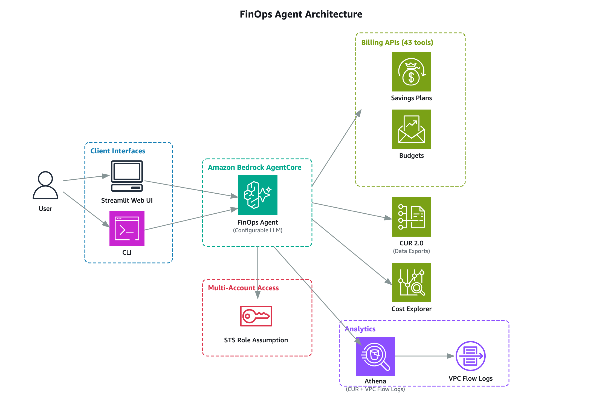

# Cost Analyzer Agent

> ⚠️ **Disclaimer:** Code is provided under MIT-0 license. Review, fine tune, and test before using it in production. Review all configurations, IAM permissions, and costs before deploying in any environment.

Cost Analyzer Agent helps teams analyze, understand, and optimize AWS costs across multiple accounts using natural language. Built with [Amazon Bedrock AgentCore](https://docs.aws.amazon.com/bedrock/latest/userguide/agents.html) and [Strands Agents](https://github.com/awslabs/strands-agents), it combines 43 billing APIs, Cost and Usage Report (CUR) analysis, and VPC Flow Log network insights into a single conversational interface — accessible via CLI or web UI.

## The Challenge

Managing AWS costs at scale is complex. FinOps teams juggle multiple disconnected tools — Cost Explorer for spending trends, CUR reports for resource-level details, Compute Optimizer for rightsizing, Savings Plans dashboards for commitment coverage. Each has its own interface, query language, and learning curve. Getting a complete picture requires manual correlation across these tools, Athena SQL expertise for CUR analysis, and significant time investment.

Beyond billing data, a critical blind spot exists: data transfer costs. Existing cost tools can tell you data transfer is expensive, but can't pinpoint *which network flows between which resources* are driving those costs. VPC Flow Logs hold this answer, but no native AWS tool correlates flow log data with billing data automatically.

Cost Analyzer Agent solves both challenges — it unifies billing APIs, CUR resource-level analysis, and VPC Flow Log network insights behind a single natural language interface. Ask a question in plain English, and the agent determines which data sources to query, correlates the results, and delivers actionable recommendations.

## Features

- 💰 **Cost Analysis** — Query Cost Explorer, CUR, Budgets, Pricing, and more with natural language
- 🎯 **Optimization** — Uses billing data, usage patterns, and resource metrics to suggest optimized recommendations via Cost Optimization Hub, Compute Optimizer, and Savings Plans/RI analysis
- 🔍 **Network Analysis** — VPC Flow Logs queries for data transfer insights (optional)
- 🏢 **Multi-Account** — Cross-account access via STS role assumption with credential caching
- 📚 **AWS Knowledge** — Search AWS documentation for best practices
- ⚡ **Prompt Caching** — Up to 90% cost reduction and 85% faster responses

## Architecture



## Prerequisites

- Python 3.10+
- AWS CLI configured (`aws sts get-caller-identity`)
- Amazon Bedrock model access enabled (default: Claude Sonnet 4.5, configurable in `agent/config.yaml`)
- Cost and Usage Report data accessible via Athena — set up using [AWS Data Exports](https://docs.aws.amazon.com/cur/latest/userguide/dataexports-create-standard.html). Legacy CUR format is not tested.
- IAM permissions configured — see [IAM Permissions](docs/iam-permissions.md) for required policies
- (Optional) VPC Flow Logs configured with a **custom log format** that includes fields required for analysis (`instance-id`, `az-id`, `srcaddr`, `dstaddr`, `bytes`, `start`, `end`, `protocol`, `action`, `log-status`). The default log format does not include all required fields. See [Configuration Guide](docs/configuration.md#vpc-flow-logs-custom-log-format) for the recommended format.

## Quick Start

### 1. Clone and configure

```bash
git clone https://github.com/aws-samples/sample-cost-analyzer-agent.git
cd sample-cost-analyzer-agent
cp agent/config.yaml.example agent/config.yaml
```

Edit `agent/config.yaml` with your accounts and Athena settings. See [Configuration Guide](docs/configuration.md) for details.

```yaml
accounts:
  - account_id: "111111111111"
    role_arn: "arn:aws:iam::111111111111:role/CostAnalyzerAgentPayerRole"
    account_type: payer
    athena:
      cur:
        database: cur_db
        table: cur_table
```

### 2. Deploy

```bash
./deploy.sh
```

### 3. Use

```bash
# Interactive CLI
./cli/cli.sh

# Single query
./cli/cli.sh -q "What are my top 5 services by cost last month?"

# Web UI (optional)
cd frontend && streamlit run app.py
```

> ⚠️ **Security Note:** The Streamlit web UI has no built-in authentication. Run it locally only and do not expose it to the internet. For network access, restrict through security groups. For production deployments with authentication, see [sample-amazon-bedrock-agentcore-fullstack-webapp](https://github.com/aws-samples/sample-amazon-bedrock-agentcore-fullstack-webapp).

## Example Queries

```
What were my top 5 services by cost last month?
Show me cost optimization recommendations
Compare costs between last month and this month
Which EC2 instances cost the most?
What are my Savings Plans utilization rates?
Analyze VPC Flow Logs for top network talkers in March
```

## Project Structure

```
├── agent/                  # Agent deployment (deploy once)
│   ├── agentcore_agent.py  # AgentCore entrypoint
│   ├── config.yaml.example # Configuration template
│   ├── prompts/            # System prompt
│   ├── services/           # Config, Athena, MCP, session management
│   └── tools/              # Billing, Athena, date, analysis tools
├── cli/                    # CLI interface (daily use)
├── frontend/               # Optional Streamlit web UI
├── shared/                 # Shared client config and prompt library
├── tests/                  # Property-based tests (hypothesis)
└── deploy.sh               # One-command deployment
```

## Documentation

| Document | Description |
|----------|-------------|
| [Configuration Guide](docs/configuration.md) | Account setup, Athena config, cross-account access, prompt caching |
| [IAM Permissions](docs/iam-permissions.md) | Required IAM policies for deployment, invocation, and runtime |
| [Tools Reference](docs/tools.md) | All 50+ tools: billing, Athena, knowledge, helpers |
| [CLI Guide](cli/README.md) | CLI usage, prompt library, debug mode |

## Supported and Not Supported

| Feature | Status | Notes |
|---------|--------|-------|
| CUR 2.0 (AWS Data Exports) | ✅ Supported | Tested and designed for this format |
| Legacy CUR | ⚠️ Not tested | May work but column compatibility is not verified |
| VPC Flow Logs to S3 (Athena) | ✅ Supported | Parquet format recommended |
| VPC Flow Logs to CloudWatch Logs | ❌ Not supported | Only S3-based Flow Logs queryable via Athena |
| Multi-account (Organizations) | ✅ Supported | Payer + member accounts via STS role assumption |
| Single account | ✅ Supported | No cross-account roles needed |

## Troubleshooting

| Issue | Fix |
|-------|-----|
| "Agent not found" | Check agent ID in shared/client.yaml, run `agentcore status` |
| "Access denied" | Verify credentials: `aws sts get-caller-identity` |
| Athena query failures | Verify `athena.cur`/`athena.vpc_flowlogs` config, check Athena workgroup output location |
| Cost Explorer errors | Ensure IAM role has `ce:*` permissions |

Enable debug mode: `./cli/cli.sh -v -q "test"` or `agentcore logs` for CloudWatch logs.

## Cost

> **Note:** The costs below are estimates based on typical usage patterns. Actual costs vary based on query complexity, data volume, model selection, and usage frequency. If VPC Flow Log analysis is enabled, additional Athena scan costs apply — see estimate below.

Running this agent incurs costs from multiple AWS services:

| Service | Pricing | Notes |
|---------|---------|-------|
| Amazon Bedrock (Claude Sonnet 4.5) | ~$0.02–0.04 per query | With prompt caching enabled (90% input token savings on cache hits). First request per session costs more due to cache write. Estimate based on ~5K cached input tokens, ~1K non-cached input tokens, and ~1.5K output tokens per query. |
| Amazon Bedrock AgentCore Runtime | Per-second billing for CPU/memory | Consumption-based; you only pay while sessions are active. See [AgentCore pricing](https://aws.amazon.com/bedrock/agentcore/pricing/). |
| Amazon Athena (CUR) | $5 per TB scanned | CUR queries. Use partitioned Parquet data to reduce scan costs. |
| Amazon Athena (VPC Flow Logs) | $5 per TB scanned | VPC Flow Log queries (optional). Flow log tables are typically much larger than CUR — partition by date and use Parquet format to control costs. |
| AWS Cost Explorer API | $0.01 per request | Each billing tool call is an API request. |
| AWS Knowledge MCP | No additional cost | Uses the AWS documentation MCP server. |

Actual costs depend on query complexity, data volume, and usage frequency. Enable prompt caching (`cache_tools: true` and `cache_ttl` in config) to minimize Bedrock token costs.

### Example: Single query cost breakdown

Query: *"What are my top 5 services by cost last month?"*

This query triggers `get_current_date_context` + `get_cost_and_usage` (2 tool calls, 1 Cost Explorer API request).

| Component | Calculation | Cost |
|-----------|-------------|------|
| Bedrock inference | ~5K cached input tokens × $0.30/1M + ~1K input tokens × $3/1M + ~1.5K output tokens × $15/1M | ~$0.03 |
| AgentCore Runtime | ~15s execution × $0.000056/s (0.25 vCPU) | ~$0.001 |
| Cost Explorer API | 1 API call × $0.01 | $0.01 |
| **Total per query** | | **~$0.04** |

A more complex query like *"Show me the top 10 most expensive EC2 instances last month"* would additionally trigger an Athena CUR query (~10 MB scanned = ~$0.00005) and 2–3 more tool call round-trips, bringing the total to ~$0.06–0.08.

Without prompt caching, the Bedrock inference cost would be roughly 5–10× higher (~$0.15–0.40 per query), making caching a significant cost saver for regular usage. Athena costs can vary significantly depending on table size and whether data is partitioned and stored in columnar format (Parquet).

## Why Not AWS Billing MCP?

This agent uses native boto3 billing tools instead of the AWS Billing MCP server. The reason: cross-account cost analysis requires routing billing API calls through the payer account via STS role assumption. The agent's `SessionManager` handles this by assuming roles into payer and member accounts, caching credentials, and routing each billing tool call through the correct account context. The AWS Billing MCP server does not support this cross-account routing between payer and delegated administrator accounts, which is essential for multi-account FinOps workflows.

## Security

See [CONTRIBUTING](CONTRIBUTING.md#security-issue-notifications) for reporting security issues.

## License

MIT-0. See [LICENSE](LICENSE).

## Contributing

See [CONTRIBUTING.md](CONTRIBUTING.md).
